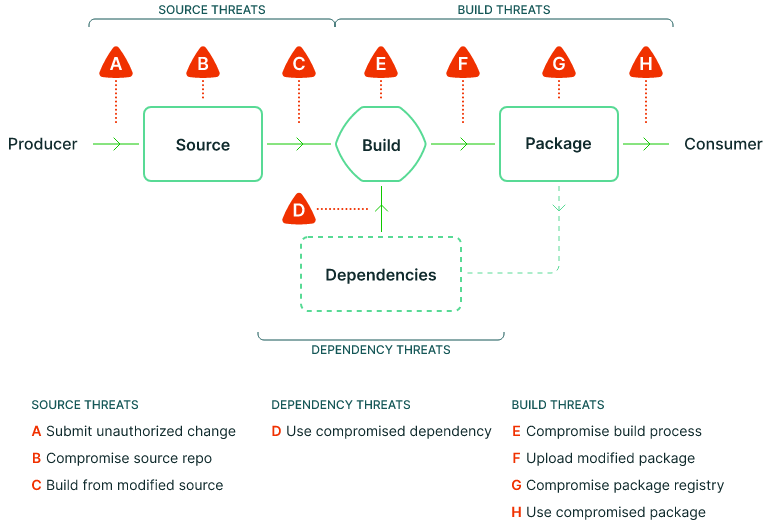

# GitHub Reusable Workflows

This repository have reusable workflows for building a SLSA level 3
secure software supply chain.

The following figure illustrates [SLSA Supply chain
threats](https://slsa.dev/spec/v1.0/threats-overview):



See [example application
pository](https://github.com/michaelvl/sigstore-in-toto-workshop) for
an example use of the workflows from this repositoty.

## Protections

Mitigation of threats as described by SLSA are described below.

Legend

- :memo: Attestation or other metadata produced/used by workflows.
- :no_entry: Control/governance point, i.e. decision point for accepting artifacts.
- :tophat: Trusted process through separation of duties.
- :x: No mitigation

Mitigation mechanisms for threat-points from figure above:

- A. Submit unauthorized source:
  - :memo: PR provenance attestation showing PR status, who reviewed, approved and merged etc.
  - TODO: Investigate [Gittuf](https://github.com/gittuf/gittuf)
- B. Compromised source repository:
  - :x: None
  - TODO: Produce Git signature attestation
- C. Build from modified source
  - :x: None
  - TODO: Produce Git signature attestation
- D. Compromised dependencies
  - :memo: SBOM attestation
  - :memo: Container CVE scan attestation
- E. Compromised build process
  - :tophat: Separated workflows using GitHub [reusable workflows](https://docs.github.com/en/actions/using-workflows/reusing-workflows)
  - :memo: SLSA provenance using the [slsa-github-generator](https://github.com/slsa-framework/slsa-github-generator)
  - :no_entry: Apply organisation policies using [artifact-underwriter](https://github.com/michaelvl/artifact-underwriter)
  - :memo: Generate [Verification Summary Attestation (VSA)](https://slsa.dev/spec/v1.0/verification_summary) based on organisation policy verification status
- F. Upload modified artifacts
  - :memo: Container digest used throughout workflows
  - :memo: Container signed
- G. Compromised artifact storage
  - :memo: Container digest used throughout workflows
  - :memo: Container signed
- H. Deploy compromised artifact
  - :memo: Container digest used to identify container artifact
  - :memo: Container signed
  - :no_entry: [Sigstore policy controller policies](https://github.com/sigstore/policy-controller)

Note, that SLSA levels describe the build-phase and does not cover the
source-phase, i.e. tampering with the source prior to building.

## Pull-request Attestation

The [policy-verification workflow](.github/workflows/policy-verification.yaml) applies Rego-based organisation policies to the attestions produced by prior workflows using [artifact-underwriter](https://github.com/michaelvl/artifact-underwriter). Based on the policy verification result, a [Verification Summary Attestation (VSA)](https://slsa.dev/spec/v1.0/verification_summary) is issued.

The attestations produced by the workflows are generally standardised,
except for the pull-request attestation since no standard exists. The
produced pull-request attestation are summarised below.

```yaml
{
  "_type": "https://in-toto.io/Statement/v0.1",
  "predicateType": "https://github.com/michaelvl/gha-reusable-workflows/pr-provenance",
  "subject": [
     ...
  ],
  "predicate": {
    "pull_requests": {
      "associatedPullRequests": {
        "nodes": [
          {
            "author": {
              ...           # Who created the PR
            },
            "approvers": {
              ...           # Who approved the PR
            },
            "assignees": {
              ...           # PR review assignees
            },
            "body": ...,    # Body text of PR
            "mergedAt": ...
            "mergedBy": ...   # Who merged the PR
            "reviewDecision": # Overall review state
            "state": "MERGED",
            "title": ...
          }
        ]
      },
    },
    "repository": {         # Git references
      "digest": {
        "sha1": ...
      },
      "name": ...
      "ref": ...
       ...
    }
  }
}
```

## Links

- GitHub attacks and protections
  * GitHub attack tree: [SLSA dip — At the Source of the problem!](https://boostsecurity.io/blog/slsa-dip-at-the-source-of-the-problem)
  * [Using SSH does not imply Git integrity](https://github.com/michaelvl/git-signature-checker)
  * GitHub action pinning [ratchet](https://github.com/sethvargo/ratchet)
- Signing artifacts:
  * [Cosign](https://github.com/sigstore/cosign)
    - [Race condition when creating multiple signatures](https://github.com/sigstore/cosign#registry-details)
  * [Gitsign](https://github.com/sigstore/gitsign)
  * [provenance generation and verifying attestation using cosign with new predicate type](https://github.com/sigstore/gitsign/issues/105)
- [Spicing up Container Image Security with SLSA & GUAC - Ian Lewis, Google](https://www.youtube.com/watch?v=32IhwdAe0yI)
- [Supply-chain Levels for Software Artifacts, SLSA](https://slsa.dev)
- Inspiration:
  * [github.com/liatrio/gh-trusted-builds-workflow](https://github.com/liatrio/gh-trusted-builds-workflow)
